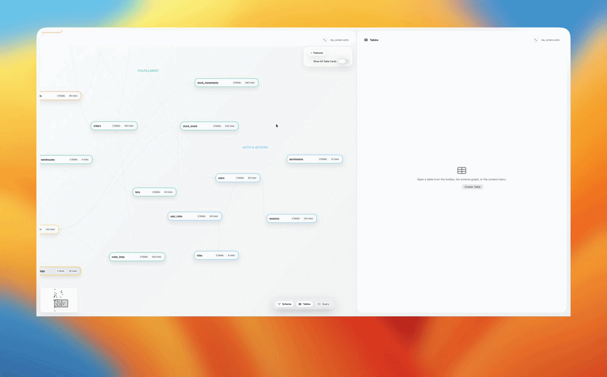

# SQLite Graph Studio

A macOS app for browsing SQLite databases and connecting to PostgreSQL in a strictly read-only mode. Explore schemas as interactive graphs, browse rows, run safe read queries, and export results.



<p>
  <a href="../../releases/latest">
    
  </a>
</p>

> **No Xcode or Swift required.** Download the DMG, drag SQLite Graph Studio to Applications, open.

---

## Features

- Interactive schema graph showing foreign-key relationships and cardinality
- Inline row editing with right-click row actions (add, clone, delete)
- Column sorting, filtering, and search
- SQL query runner with explain plan
- User-selected PostgreSQL connection documents with schema-qualified catalog browsing, paging, search, filtering, sorting, exports, query history, and non-executing EXPLAIN
- Schema notes from a sidecar file — table and column descriptions in `<database>.studio.json` show up as hover tooltips on graph nodes, table grids, and query result headers (see the [schema-descriptions](.claude/skills/schema-descriptions/SKILL.md) skill for AI-assisted authoring)
- AI-authored cluster hints — let an agent group related tables by a chosen lens, defaulting to domain areas but supporting concepts like people, artifacts, departments, workflows, or ownership (via the [graph-clusters](.claude/skills/graph-clusters/SKILL.md) skill)
- AI-authored flow stories — agents can append user-story-inspired flow cards with acceptance notes, schema-cluster tags, lightweight story links, and narrated graph playback to the sidecar; **Features → Stories** plays them back and can show them as minimal graph-native cards connected to the schema tables they cover (via the [story-flows](Skills/story-flows/SKILL.md) skill)

## AI Skills

Three optional AI coding agent skills let you enrich the graph with a single prompt:

- **graph-clusters** — Groups your tables into meaningful clusters. It defaults to domain areas, and you can ask for another lens such as people, artifacts, departments, workflows, or ownership. Run from your AI coding agent.
- **schema-descriptions** — Annotates your tables and columns with hover descriptions shown in the graph, table grids, and query results. Run from your AI coding agent.
- **story-flows** — Turns questions like "what happens when a user signs up?" into user-story-inspired flow cards with acceptance notes, schema-cluster tags, lightweight story links, graph playback, and hidden `spoken_text` for optional read-aloud playback.

Download them from inside the app: **Database → AI Skills…** — or from the prompt that appears when you open a database with more than 10 tables. Skills are installed next to your `.sqlite` file so any AI coding agent in that directory can use them.

For Codex, create `.agents/skills` in your repo first; the app will install `graph-clusters`, `schema-descriptions`, and `story-flows` there. Use `/skills` or mention `$graph-clusters`, `$schema-descriptions`, or `$story-flows` in Codex to invoke them.

## PostgreSQL connections

Choose Open PostgreSQL Document… from the toolbar, the Database menu, or the empty state. A PostgreSQL document is a user-managed .postgres or .pgstudio JSON file containing only endpoint properties:

    {
      "name": "Read-only database",
      "host": "database.example.test",
      "port": 5432,
      "database": "catalog",
      "username": "reader",
      "tlsMode": "required"
    }

Graph Studio does not show a login form, save connection profiles, or put credentials in documents. PostgreSQL authentication is delegated to the server's configured passwordless mechanism or to the user's existing PGPASSWORD/PGPASSFILE environment configuration. TLS required verifies the server certificate; TLS disabled is intended only for a deliberately local, trusted endpoint.

PostgreSQL sessions are permanently read-only:

- The connection requests default_transaction_read_only=on.
- Catalog, table browsing, query execution, and EXPLAIN each run inside an explicit READ ONLY transaction.
- Every PostgreSQL table descriptor and column is non-editable. Row edits, inserts, deletes, imports, table creation, schema changes, and write SQL are disabled in the UI and fail closed in the backend.
- The query gate accepts SELECT, VALUES, SHOW, read-only WITH queries, and EXPLAIN. It rejects multiple statements, comments/literal bypasses, transaction control, DDL/DML, COPY, CALL, DO, SET/RESET, VACUUM, EXPLAIN ANALYZE, and known side-effecting functions before sending the statement.

PostgreSQL metadata is read from pg_catalog in set-based queries. System and temporary schemas are excluded. Tables, partitioned tables, views, and materialized views include columns, format_type output, nullability, defaults, generated and identity metadata, primary keys, indexes, foreign keys, row estimates, and graph cardinality. Initial catalog loading does not count table rows. Query results are capped at 500 visible rows by default (up to 10,000 for the backend request) and report truncation; table browsing uses bound search/filter/paging values.

The PostgreSQL connection intentionally does not create a SQLite-style schema sidecar or install AI skills for the remote target. Query history, saved queries, and graph layout use a password-free, hashed target key. No connection profile data is written to app preferences.

## Install

1. Go to [Releases](../../releases/latest)
2. Download `SQLiteGraphStudio.dmg`
3. Open the DMG and drag `SQLiteGraphStudio.app` to `/Applications`
4. Open a .sqlite file or .postgres document with it

> **First launch:** macOS may block the app since it isn't notarized. If you see a "damaged" or Gatekeeper warning, run this once in Terminal:
>
> ```bash
> xattr -cr /Applications/SQLiteGraphStudio.app
> ```
>
> Then open the app normally. Alternatively:
>
> 1. Open **System Settings → Privacy & Security**
> 2. Scroll down and click **"Open Anyway"** next to the app name
> 3. Confirm in the dialog that appears

## Build from source

Requires Xcode 15+ or the Swift toolchain. Built in Swift/SwiftUI — not because it's the obvious choice for a database tool, but because it was the fastest way to build something native on macOS that felt good to use.

```bash
git clone https://github.com/Albertsteenstrup/SQLiteGraphStudio.git
cd SQLiteGraphStudio
swift run SQLiteGraphStudio /path/to/database.sqlite
```

### PostgreSQL verification

The normal unit suite does not require a running PostgreSQL server. To run the opt-in integration tests, provide an explicitly chosen test database through environment variables and set SGS_POSTGRES_TESTS=1:

    SGS_POSTGRES_TESTS=1 \
    SGS_POSTGRES_HOST=... \
    SGS_POSTGRES_PORT=... \
    SGS_POSTGRES_DATABASE=... \
    SGS_POSTGRES_USER=... \
    SGS_POSTGRES_PASSWORD=... \
    swift test --filter PostgreSQLIntegrationTests

The integration suite is skipped unless the opt-in flag and all required connection variables are present. It does not use application defaults, fixtures, source data, or a bundled PostgreSQL document.

## Reporting issues

Open a [GitHub Issue](../../issues) — include your macOS version and what you were doing when it broke.

## License

MIT — see [LICENSE](LICENSE).

## Record inspection and navigation

Right-click a loaded row and choose **Inspect Record…** to read full values, follow foreign keys, and explore a bounded graph of actual records on SQLite or read-only PostgreSQL. Back/forward preserves the originating table or query context. The record graph has separate state from the schema graph and supports catalog-validated mappings for explicit node/edge tables. See [Record exploration](docs/record-exploration.md) for controls, limits, and mapping examples.
