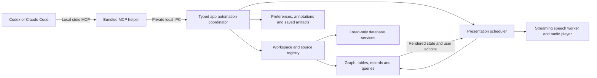

# Agent-driven exploration in SQLite Graph Studio

Design from the requirements interview, completed 22 September 2026. This document describes the intended product, not implemented behavior. The companion [MCP catalog](agent-exploration-mcp-tools.md) defines the proposed tools; the [delivery and validation plan](agent-exploration-validation.md) covers the complete scope.

## Product direction

The user asks Codex or Claude Code a question. The agent investigates the database and relevant application code, then uses a local MCP connection to show its explanation in Graph Studio. It can show one useful view, guide the user through several short points, inspect records, run a read-only query, or explain a proposed schema change. No user-story format, acceptance-note template, or predetermined narrative structure is required.

The agent decides what to explain and which views help. Graph Studio owns visual readiness, speech playback, viewing time, and immediate user control. Narration comes from Graph Studio by default. This makes timing independent of the agent's reasoning speed and allows the user to pause even while the agent is busy.

The required scope includes all of the following:

- Explain a model, a business process, individual tables, fields, relationships, and application behavior.
- Select, arrange, expand, highlight, drag, zoom, and temporarily isolate relevant graph objects.
- Inspect full field values, sort and filter tables, follow records, and run and display read-only query results.
- Show proposed changes and actual schema comparisons using the existing preview and diff workflows.
- Adapt explanations to the person and database, support interruption and correction, and explicitly save faithful explanations when requested.
- Support both Codex and Claude Code, app-led and agent-led setup, and several databases or artifacts in separate tabs within one window.

Deliver this through stages, with the full scope retained. A working first demonstration is a proof of the architecture, not completion of the request.

## Everyday experience

### First use and opening the application

Setup is available from Graph Studio and from the coding agent. Both use the same installer and diagnostics. The default installation registers the local MCP helper and maintained skills once for the user in each coding agent. Project-specific overrides remain possible.

At the first real explanation, ask two short questions: how familiar the user is with technical database concepts, and how familiar they are with this particular data model. Allow a short free-text answer or skipping. Save the general explanation preference and database-specific familiarity separately. Explicit feedback such as “explain this less technically” updates the preference; “just for this answer” creates a temporary override. Do not infer a durable preference from a single click or pause.

For “show me the tables involved in approval,” the agent may launch Graph Studio directly. For a general coding question where visualization is only an optional aid, offer to open it. A status check does not itself launch the app. Opening a requested visualization is not a second permission question.

Resolve the database from an explicit reference or relevant current selection first, then the established task/database association. Ask when multiple plausible sources remain. Never silently substitute another open database. Show a concise source label throughout; full connection or file details are available on demand without exposing credentials.

### Workspaces and tabs

Use one primary tab bar. Each tab is a complete workspace whose default is a graph/data split. The right pane can show a table, query, record details, or comparison details. Either pane can be maximized and restored. These are workspace tabs, rather than separate primary tabs for “Graph,” “Data,” and “Query.”

Tabs may contain different SQLite files, PostgreSQL sources, previews, comparisons, or saved explanations. Each owns its camera, selected objects, graph arrangement, visible fields, filters, sorts, query drafts, and navigation history. Compact table/query selectors inside a workspace can remain where useful; they must not compete with the primary tab bar.

A coding task gets a reusable explanation workspace. Existing manual work stays available in its own tab. New comparison work can use additional tabs. Background agent activity can prepare or update its own tab but must not activate it or speak over another explanation. One narrator is active across the application. An explicit new user request can switch to another task's explanation; an unsolicited background update cannot.

Restore tabs, view state, and query drafts across launches. Restored result displays identify their age. Do not automatically replay speech, re-run expensive queries, reconnect to a substituted source, or resume an obsolete presentation.

### A point in an explanation

For example, “Show the tables involved in processing an order” might first show `orders`, `order_items`, and `products`, with a short caption: “An order contains line items, and each line identifies the product being purchased.” The agent can then open filtered rows or explain a less obvious part of the implementation. It can also choose to stop after the first useful view.

Use ordinary language for explanations. Display exact names when identifying tables, columns, and values. A separate pronunciation hint can make `process_id` sound like “process ID” without changing the identifier shown on screen. Schema facts, behavior confirmed in code, and interpretations must be distinguishable in the explanation and its expandable evidence details.

Show the current point as a short caption. Provide an expandable transcript and earlier points. The main controls are Pause/Continue, Back, Next, and End. Repeat current point, speaking speed, and detailed history are secondary controls. Support keyboard access, accessible control names, reduced motion, and useful text-only operation.

Pause stops audio and pending visual actions immediately. Dragging, zooming, or selecting during narration instead finishes the current short spoken point, then pauses progression. The view must stay where the user left it; no queued camera animation may pull it back. Continue is explicit and starts from the revised current view.

The user corrects or questions the agent in its existing text or voice conversation. A clarification can be answered and the earlier explanation resumed. A correction replaces pending points. A new topic can start a different explanation. Back revisits prior views without reviving cancelled future actions. End or natural completion leaves the last view fully interactive. “Return to previous workspace” restores the view that preceded the explanation.

## Graph and data behavior

### Selection, relationships, and arrangement

Start with a small relevant set of core and supporting tables when that helps. Direct neighbors are a useful initial default, not a mandatory inclusion rule. The agent may show a subset, expand further, return to an earlier group, or choose a broader overview. Best practices guide presentation; they do not prescribe a fixed sequence or table count.

Only real declared database relationships are drawn as ordinary graph edges. Tables associated through application code, naming, business meaning, or an inferred join can be shown together and described in words, but no extra relationship line is drawn. Proposed foreign keys may appear as clearly marked proposed edges inside a proposal workspace. Actual comparisons label each edge's version and status.

The agent can temporarily move any selected tables closer together, including disconnected tables. This is a layout change, never evidence of a relationship. Preserve the earlier arrangement for return. Selected subsets may hide unrelated tables, with an obvious route back to the full model. Manual dragging, pinning, panning, and zooming remain available.

Expand tables to show relevant fields and necessary primary/foreign keys, indicate that fields are hidden, and offer Show all. Selecting a key can focus its declared connections and bring the relevant tables closer. Handle composite keys as complete keys, distinguish multiple foreign keys between the same tables, and allow direction and selected-relation control.

Node sizing supports fields, rows, relationships, or uniform sizing. Save the user's choice per database. Zooming out increases the chosen emphasis while maintaining a usable overview. Agent overrides are temporary unless persistence was requested. Unknown row counts are marked unknown and do not trigger a full count of every table.

### Tables, values, and records

The grid supports typed filters, multi-column sorting, column selection and order, pagination, and clear result counts. Full values open in an inspector within the workspace, beside or below the grid. Include raw and formatted JSON views, search, copy, and visible table/column/record identity. Distinguish SQL NULL, empty text, and an absent value. Fetch large values explicitly and in bounded chunks.

Following a record coordinates the schema graph and matching rows in the data pane. A record graph is available when it improves understanding. Resolve declared relationships accurately, including composite keys and missing targets. Application-defined record mappings can still aid navigation when labeled as such; they must not become fabricated database edges. For the guided graph, application-only associations remain co-displayed and explained in words.

For “explain this,” the agent reads the relevant selection, filter, record, and pane state. Clicking alone does not initiate a conversation with an idle coding agent.

### Queries and authority

The agent may prepare and run read-only SQL, inspect a non-executing query plan, and show results. SQL remains inspectable. Use bounded result pages, execution timeouts, cancellation, explicit truncation, and stable result-column identities even when column labels repeat. Large counts and exports are deliberate operations with progress, not hidden prerequisites for rendering.

MCP access to the actual database is read-only, including SQLite. Enforce this in database connections and execution controls; a tool description or SQL prefix check is insufficient. Do not expose inserts, updates, deletes, schema migrations, arbitrary scripts, or a generic method invocation escape hatch through this server. Existing manual editing in the app need not be removed. The coding agent can implement changes using its normal development tools, then explicitly refresh or compare the resulting schema.

Return only the relevant bounded values needed to answer the question, with additional pages or full-value reads on demand. Showing data in Graph Studio need not also send all of it to the agent. The local MCP connection describes where the bridge runs, not where a coding agent's model processes returned data.

## Live explanations and voice

### Scheduling contract

A presentation is an optional sequence of short explanatory points. Each point contains a caption, optional narration, typed view actions, evidence references, and timing intent. An immediate single view uses the same underlying actions without requiring a presentation.

The agent can append a few points, revise what remains, hold for the user, or finish. Preparing two to four upcoming points is a useful starting guideline, not a required narrative shape. The app can synthesize upcoming audio while displaying the current point, within a bounded buffer. It does not need the entire answer before starting.

For each point:

1. Resolve data dependencies and validate the whole view update against the intended source and workspace revision.
2. Commit the coherent view update and wait until it is rendered in the visible presentation workspace. A background preparation is not a visible presentation.
3. Start narration, if enabled, when the relevant visual is ready. The caption is available immediately.
4. Advance only after both playback completion and the requested minimum visible time, plus any requested additional hold. A manual advance policy waits for Continue/Next.

Conceptually, automatic advancement is `max(audio_finished, visible_since + minimum_viewing_time) + extra_hold`. Use actual audio playback completion, not inference completion or a guessed word count. Pausing freezes remaining dwell time. Muted/text-only points receive a reading-time default that the agent can adjust.

Expose distinct states such as preparing, rendered in background, visible, speaking, waiting, paused, completed, and failed. Report which objects were actually displayed. On failure, retain the last good view, pause, and provide Retry/Skip/End. Do not speak as though a failed query or missing table was shown.

Revision changes invalidate old pending actions, audio buffers, and completion callbacks. Already displayed history remains identifiable. Explicit Pause, End, tab closure, and source replacement cancel work promptly. Switching away from a narrating tab pauses it, preventing unseen playback. Returning does not unexpectedly restart it.

### Codex voice and live agent control

Codex documents voice conversation with the selected task/model and natural interruption. This supports investigating a hybrid conversation, but the published feature description does not establish a third-party contract for precisely coordinating audible speech with Graph Studio rendering and dwell times. [Codex voice documentation](https://learn.chatgpt.com/docs/features/voice).

The selected default is therefore app narration. Codex voice remains a conversation/input option to test. Replacing local narration entirely requires an actual end-to-end demonstration of difficult reasoning, visual readiness, adequate viewing time, and easy interruption/correction in the installed Codex version. Native voice audio coordination, echo or overlapping narration, and automatic speech interruption are experiments, not promised capabilities. The reliable baseline always has the app's immediate Pause control.

A local MCP server can report events and state; it cannot by itself force an idle coding agent to reason about a click or receive the agent's microphone stream. An active agent can wait for events, append points, and adapt. Provide cursor-based bounded event waits with status polling as a fallback; host notifications can improve the experience when supported. Core functionality must work in both clients without assuming a proprietary push or voice hook.

### Speech candidate decision

Evaluate these in order against the real 8 GB Apple Silicon application workload. English is the initial language. None has been downloaded, integrated, or benchmarked for this design.

| Candidate | Why evaluate it | Remaining proof |
| --- | --- | --- |
| **Pocket TTS, September 2026 English revision — first candidate** | A 100M CPU model with streaming audio and an explicit generation cancellation API. The official configuration includes a separate nongated checkpoint without voice cloning. | Packaged runtime footprint, preset-voice compatibility and attribution, natural database explanations, and measured performance with Graph Studio on an 8 GB Mac. |
| **VibeVoice-Realtime-0.5B** | Designed for incremental text input and streamed speech; useful if continuous text arrival produces a better experience. | Full runtime memory, supported Mac execution path, cancellation behavior, and actual startup/streaming latency. The parameter count in the name is not the installed runtime size. |
| **Qwen3-TTS-12Hz-0.6B-CustomVoice** | Quality and multilingual comparator; upstream lists streaming support for this variant. | Verify that the chosen local runtime exposes useful streaming rather than only completed audio, then measure Mac memory and latency. Further languages are outside the initial language requirement. |

Sources: [Pocket model card](https://huggingface.co/kyutai/pocket-tts-without-voice-cloning), [Pocket streaming API](https://github.com/kyutai-labs/pocket-tts/blob/main/docs/API%20Reference/python-api.md), [pinned September English configuration](https://raw.githubusercontent.com/kyutai-labs/pocket-tts/0acce6b2f390150267557770d2098c5caa9a18ac/pocket_tts/config/english_2026-09.yaml), [VibeVoice model card](https://huggingface.co/microsoft/VibeVoice-Realtime-0.5B), [Qwen model card](https://huggingface.co/Qwen/Qwen3-TTS-12Hz-0.6B-CustomVoice) and [upstream variant table](https://github.com/QwenLM/Qwen3-TTS#released-models-description-and-download).

Pocket's publisher advertises roughly 200 ms to the first chunk; this is not a Graph Studio result or an 8 GB guarantee. The full Pocket checkpoint currently has an access gate. Prefer testing the official nongated preset-voice path; do not design installation around silently accepting gated terms. The model card currently identifies CC BY 4.0 weights. Voice assets have separate licenses: for example, Alba MacKenna recordings are CC BY 4.0, while some other collections are noncommercial. Pin and document the exact shipped voice and model assets. [Model access](https://huggingface.co/kyutai/pocket-tts), [voice provenance](https://huggingface.co/kyutai/tts-voices).

Also considered: [Supertonic 3](https://huggingface.co/Supertone/supertonic-3) offers an ONNX deployment path, but the inspected example produces a completed waveform; useful chunk streaming would need separate verification. It is not the first candidate solely on the basis of on-device claims.

Replace the current complete-WAV playback architecture with a persistent model worker and streamed PCM playback. Keep model and selected preset voice warm during use, prebuffer bounded upcoming audio, stop generation and playback separately, and release resources when idle or under memory pressure. A provider interface allows switching models without changing presentation tools.

The first enablement offers the model/runtime download with the actual combined size, progress, cancellation, and retry. The app manages the runtime; users do not install Python or run terminal commands. A managed Python worker can establish the initial reference behavior, but the shipped runtime must be packaged, pinned, and tested. Native alternatives require parity testing rather than an assumption that a community port is equivalent.

Target approximately one second from ready narration text to first audible audio with a warm model. Report reasoning delay, model cold load, first generated chunk, first audible sample, sustained generation, and interruption delay separately. Audio completion comes from the output device pipeline, including drained buffers. Visual/text interaction continues if speech is unavailable or disabled.

## Architecture and existing code

**Proposed engineering structure:** a small bundled executable speaks MCP over standard input/output and works even while the app is closed. It reports availability and launches the app only through the launch operation. Once the app runs, the helper forwards typed commands through a private same-user IPC endpoint. Use an owner-only runtime directory/socket, peer validation, and an app-instance credential; no public network listener is required. Multiple agent processes have distinct client/task identities and reconnect through explicit state reconciliation.

Local stdio is supported by Codex and Claude Code. Implement protocol-version compatibility against the installed clients, rather than assuming both already speak the newest specification. Keep protocol output separate from logs. [Codex MCP](https://learn.chatgpt.com/docs/extend/mcp?surface=cli), [Claude Code MCP](https://code.claude.com/docs/en/mcp), [MCP transports](https://modelcontextprotocol.io/specification/2026-07-28/basic/transports).

Separate application/window state, source resources, workspace state, and presentation state. A source resource may be shared by several tabs, with reference-counted database and PostgreSQL restore lifetimes. Each tab has its own browsing/query state. Do not duplicate a whole database connection and model for every view unnecessarily. Source IDs must distinguish files, schemas, restored backups, and versioned artifacts; table names alone are not identities.

Use a typed automation coordinator shared by MCP and native controls. Do not remotely call arbitrary `AppSession` methods. UI mutations run on the appropriate actor; reads, synthesis, exports, and query jobs have bounded background work and cancellation. Every asynchronous result carries source, workspace, and revision identity to prevent stale results appearing in another tab.

| Current code | Design implication |
| --- | --- |
| [App entry](../Sources/SQLiteGraphStudio/SQLiteGraphStudioApp.swift), [AppSession](../Sources/StudioCore/App/AppSession.swift) | Current shared session/source state needs separation into registries and per-tab workspaces before broad automation. Preserve synchronous native startup and existing CLI dispatch. |
| [Root view](../Sources/StudioCore/App/StudioRootView.swift), [pane state](../Sources/StudioCore/App/WorkspacePaneState.swift), [query model](../Sources/StudioCore/App/QueryWorkspaceModel.swift) | Retain the split-screen default, isolate drafts and pane state, and replace story-specific full-screen behavior. |
| [Node sizing](../Sources/StudioCore/GraphModel/GraphNodeSizing.swift), [focus hierarchy](../Sources/StudioCore/GraphView/GraphFocusHierarchy.swift), [story placement](../Sources/StudioCore/GraphView/StoryGraphPlacement.swift) | Reuse existing metric sizing and focus machinery; extract reusable arrangement from story concepts. |
| [Record workspace](../Sources/StudioCore/Records/RecordWorkspace.swift) | Reuse relation loading, identity handling, bounded jobs, and navigation history while coordinating graph and grid within a tab. |
| [Database facade](../Sources/StudioCore/Database/DatabaseServiceFacade.swift), [capabilities](../Sources/StudioCore/Database/DatabaseCapabilities.swift) | Existing services expose write methods and SQLite can open writable. Add a read-only automation capability and connections; preserve native manual features. |
| [Speech narrator](../Sources/StudioCore/App/StorySpeechNarrator.swift) | Replace whole-file Kokoro synthesis/playback with a provider and streamed audio lifecycle. |
| [Sidecar](../Sources/StudioCore/GraphModel/SchemaSidecar.swift), [skill installer](../Sources/StudioCore/App/StudioSkills.swift) | Preserve unrelated metadata during migration and eliminate divergent embedded/copied skill texts. |

## Persistence, skills, and removal of stories

Descriptions, groups, and notes are temporary during ordinary explanations. Save them when the user's request calls for it, such as “document these fields” or “remember this grouping.” Personal preferences follow the separate automatic-save rules above. Native controls should make saved versus temporary scope understandable without showing MCP terminology.

Saving an explanation is explicit. Capture the schema/view context, narration text and captions, selected bounded result values used by the explanation, source identity, evidence references, and capture time. Replaying it shows those historical facts even if the original source changed or disappeared. Cached audio is optional; regenerating audio from saved words does not refresh facts. Label snapshots as historical and retain exact values, types, and truncation metadata.

By default, save the points actually displayed and their captured data. Mark an interrupted point as interrupted. Do not present unshown queued points as part of a completed historical explanation. Resolving a replay must not depend on an expired live result handle.

Refresh creates a separate draft with fresh reads. The agent must revise claims and narration before publishing the refreshed explanation. Never pair historical narration with newly queried rows silently. Exports can include graph images, scoped result data, transcripts, and an explanation package; they must respect explicit scope and avoid silently expanding a displayed page into an entire database export.

| Skill | Intended integration |
| --- | --- |
| `database-explore` (new general skill) | Choose immediate versus guided presentation, gather evidence, use human language, manage context/interruptions, and explain any useful subject without a story template. |
| `graph-clusters` | Inspect schema and show temporary grouping through MCP; persist only when requested. No invented relationship edges. |
| `schema-descriptions` | Read schema and relevant code, write requested descriptions with immediate app refresh, and preserve other metadata. |
| `database-preview` | Keep the captured baseline and compact change-plan workflow; present and explain the projected result through MCP. No live migrations. |
| `database-diff` | Keep real before/after capture and existing review discipline; present actual comparisons through MCP. Do not substitute a proposal for a real captured version. |
| `story-flows` | Remove and replace with the general exploration skill; remove story-only requirements from other skills. |

Maintain one canonical skill source with generated installations for each supported client. Keep CLI and file-based preview/diff/metadata workflows for use without MCP. App-led and agent-led installation call the same versioned setup mechanism, merge existing client configuration, preserve unrelated entries, and report actual connection-test results. User-wide setup is the default; project overrides remain supported. [Claude installation scopes](https://code.claude.com/docs/en/mcp#mcp-installation-scopes).

Provide a bundled setup command so an agent can install the connection before MCP is available; the app's setup screen calls the same underlying implementation. Diagnostics distinguish configuration written, client restart/reload needed, and a connection actually verified. Send the coding task's project path explicitly when binding context: a user-wide helper's working directory is not a reliable project identity.

Retire story UI, story playback models, the old skill, and stored story entries. Before changing each sidecar, make a verified byte-for-byte backup, then perform an atomic migration that removes the known legacy entries while preserving all other fields, including unknown extensions. A failed backup or invalid document leaves the original untouched. Migrate files when encountered; do not scan arbitrary user directories. Report recoverable backup locations. Preserve user-customized installed skill files rather than overwriting them as though they were generated. Removing unrelated model caches is a separate storage decision.

## Decision record

This compact record preserves the interview answers and later corrections. Engineering choices above are proposals where the interview did not dictate an implementation.

| Question | Accepted decision |
| --- | --- |
| 1 + correction | Graph Studio narrates by default; external voice must prove reasoning, timing, viewing time, and interruption before replacing it. |
| 2 | Agent chooses immediate display or guided explanation. |
| 3 | Cover model/process explanation, design/review, and data investigation; add realistic edge cases. |
| 4 | Ask short first-use background/data-familiarity questions; persist and adapt preferences. |
| 5 | Current caption plus expandable transcript/history. |
| 6 | Natural spoken identifiers, exact identifiers on screen. |
| 7 | Schema and application evidence; bounded row reads when relevant. |
| 8 + follow-up | Useful defaults and good practices with agent freedom. |
| 9 + follow-up | Co-display application-related tables without drawing an inferred relationship. |
| 10 + follow-up | Focus relevant tables and temporarily bring even disconnected tables closer. |
| 11 + follow-up | Direct-neighbor default; subsets, expansion, and revisiting are all allowed. |
| 12 | Expand relevant fields/keys; Show all is immediately available. |
| 13 | Per-database size metric with temporary agent overrides. |
| 14 | Manual interaction finishes the current point then pauses; preserve the user's view. |
| 15 | Read relevant selection for context; selection alone does not start a conversation. |
| 16 | Short, extendable, revisable sequences with app-owned timing. |
| 17 | Adapt follow-ups into clarification, correction, or a new direction. |
| 18 | Compact main playback controls with secondary repeat/speed/history controls. |
| 19 | Ending keeps the view; explicit return restores previous workspace. |
| 20 + tab correction | Complete workspace tabs; graph/data split by default. |
| 21 | In-tab full-value inspector with raw/formatted content. |
| 22 | Coordinated graph/record browsing and optional record graph. |
| 23 | Direct bounded read-only query execution. |
| 24 | Relevant bounded values may be returned to the coding agent. |
| 25 + clarification | MCP database access stays read-only; the agent can implement changes with normal coding tools. |
| 26 | Save descriptions/groups/notes when requested, not for every explanation. |
| 27 | Separate preview/diff workspaces with focused changes and context. |
| 28 | Restore workspace state; save/export explanations explicitly. |
| 29 (C) | Back up then remove old UI, skill, and stored stories; do not convert them automatically. |
| 30 | Explicit visualization requests may launch the app; otherwise offer when useful. |
| 31 | Resolve source from explicit context or task association; clarify real ambiguity. |
| 32 (A and B) | App-led and agent-led setup; integrate existing skills and preserve offline workflows. |
| 33 | Separate workspace per coding task; one narrator; no background focus stealing. |
| 34 | Bounded recovery, last good view, clear Retry/Skip/End. |
| 35 | Hundreds of tables and millions of rows are required baseline workloads. |
| 36 | Complete the full scope through staged delivery. |
| 37 | Responsive narration on Apple Silicon, including 8 GB Macs. |
| 38 | English first. |
| 39 | Natural streamed speech; roughly one-second warm start is a measured target. |
| 40 | Synchronize short explanatory points, not individual words. |
| 41 | In-app model download and managed runtime; no manual environment setup. |
| 42 | Explicitly saved explanations are faithful historical snapshots: replay associates captured table/query pages with the points that reference them and never contacts the original source; refresh is separate. |
| 43 | User-wide setup for both agents, with per-task source binding and project overrides. |
| 44 | Different databases and artifacts can coexist in tabs within the same window. |

The remaining uncertainties are empirical: the shipped speech runtime and voice, measured performance on the target hardware, and optional native Codex voice coordination. They do not require reopening the accepted product choices.
